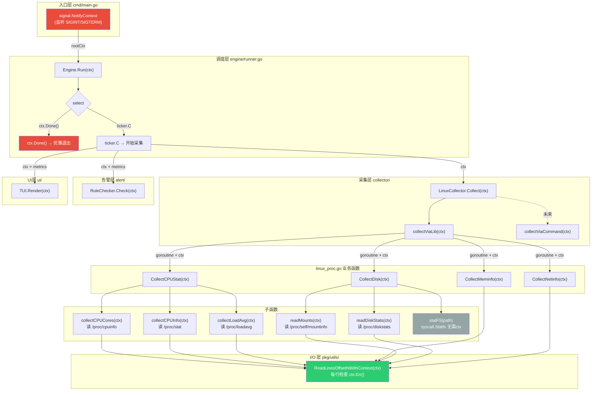

```azure
sre-monitor/                  # 项目根目录（GOPATH外/内都可）
├── go.mod                    # Go模块（模块名：github.com/你的用户名/sre-monitor）
├── go.sum                    # 依赖校验文件
├── cmd/                      # 程序入口（仅初始化，无业务逻辑）
│   └── sre-monitor/          # 可执行程序入口目录
│       └── main.go           # 核心逻辑：加载配置 → 初始化各模块 → 启动engine → 阻塞退出
├── pkg/                      # 纯通用工具（无业务逻辑，可被外部引用）
│   └── utils/                # 通用工具函数
│       ├── convert.go        # 单位转换（BytesToMB、FormatPercent等）
│       ├── exec.go           # 命令执行封装（适配macOS/Linux）
│       └── time.go           # 时间格式化工具
├── internal/                 # 核心业务逻辑（仅本项目可用，外部无法引用）
│   ├── model/                # 纯数据结构（无依赖、无逻辑，所有模块的交互标准）
│   │   ├── metrics.go        # CPU/Mem/Disk/Net指标结构体（含你优化的NetStat）
│   │   ├── diagnostic.go     # 一键诊断结果结构体
│   │   └── config.go         # 配置结构体（和configs/config.yaml一一对应）
│   ├── config/               # 配置加载逻辑（仅依赖model/config.go）
│   │   └── loader.go         # viper加载configs/config.yaml → 返回model.Config
│   ├── collector/            # 指标采集器（接口+多平台实现）
│   │   ├── interface.go      # Collector接口：Collect() (model.Metrics, error)
│   │   ├── local_darwin.go   # macOS采集实现（// +build darwin）
│   │   └── local_linux.go    # Linux采集实现（// +build linux）
│   ├── diagnostic/           # 一键诊断模块（你的核心SRE命令）
│   │   ├── interface.go      # DiagnosticRunner接口：Run() (model.DiagnosticResult, error)
│   │   ├── darwin.go         # macOS诊断实现（// +build darwin）
│   │   └── linux.go          # Linux诊断实现（// +build linux）
│   ├── alert/                # 告警模块
│   │   ├── interface.go      # AlertSender接口：Send(model.Metrics) error
│   │   ├── rules.go          # 告警规则判断（对比阈值）
│   │   └── log_alert.go      # 日志告警实现（基础版）
│   ├── ui/                   # 终端UI模块
│   │   └── tui.go            # tview/bubbletea实现UI渲染（接收model数据）
│   └── engine/               # 调度核心（组装所有模块）
│       └── runner.go         # 控制ticker循环：采集→诊断→告警→UI刷新
├── configs/                  # 配置文件模板（和业务代码分离）
│   └── config.yaml           # 配置文件（阈值、刷新频率等，对应model.Config）
└── scripts/                  # 辅助脚本（可选）
    ├── build.sh              # 跨平台编译脚本
    └── install.sh            # 安装脚本（复制二进制+配置文件）
```

## Context 传递流程

整个软件的 `context.Context` 从入口层创建，逐层向下传递，用于控制优雅退出和超时取消。



**图例说明：**
- 🔴 红色：Context 的起点和终点（信号监听 → 优雅退出）
- 🟢 绿色：Context 的最终消费者（`ReadLinesOffsetNWithContext` 每行检查 `ctx.Err()`）
- 灰色：不需要 ctx 的函数（`statFS` 单次 syscall，纳秒级返回）