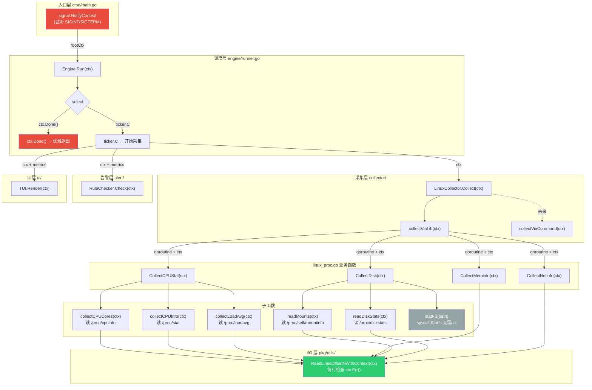

# tisminSRETool

一个基于 Go 编写的 SRE 监控工具，用于采集系统指标（CPU、内存、磁盘、网络）、执行系统诊断和发送告警通知。

## 功能特性

- **Linux 专注支持**：专注 Linux 系统指标采集
- **全面指标**：CPU、内存、磁盘、网络、进程信息
- **系统诊断**：可配置的系统健康检查
- **告警系统**：支持 CPU、内存、磁盘、网络、Inodes 阈值告警
- **速率计算**：计算采集间隔内的指标变化速率
- **邮件通知**：支持 SMTP 告警邮件发送
- **Context 支持**：通过 Context 实现优雅退出和超时控制

## Context流程图


图例说明：

🔴 红色：Context 的起点和终点（信号监听 → 优雅退出）

🟢 绿色：Context 的最终消费者（ReadLinesOffsetNWithContext 每行检查 ctx.Err()）

灰色：不需要 ctx 的函数（statFS 单次 syscall，纳秒级返回）

## 项目结构

```
tisminSRETool/
├── cmd/tisminSRETool/          # 程序入口
│   ├── main.go                 # 主程序入口（当前为空）
│   └── debug.go                # 调试/测试入口
├── configs/
│   └── config.yaml             # 配置文件
├── pkg/utils/                  # 公共工具包
│   ├── convert.go              # 单位转换工具
│   └── linereader.go           # 支持 Context 的文件行读取工具
├── internal/                    # 内部业务逻辑
│   ├── model/                  # 数据模型层
│   │   ├── config.go           # 配置结构体
│   │   ├── metrics.go          # 系统指标结构体
│   │   ├── diagnostic.go       # 诊断结果结构体
│   │   └── collector_error.go  # 采集错误结构体
│   ├── collector/              # 指标采集器模块
│   │   ├── interface.go       # Collector 接口定义
│   │   ├── linux_collector.go # Linux 采集器入口
│   │   └── linux_proc.go      # Linux 采集实现（/proc 文件系统）
│   ├── diagnostic/             # 诊断模块
│   │   ├── interface.go       # Diagnostic 接口
│   │   └── diagnostic_Linux.go # Linux 诊断实现
│   ├── alert/                  # 告警模块
│   │   ├── interface.go       # Alert 接口
│   │   ├── rules.go           # 告警规则检查器
│   │   └── sender.go          # 邮件发送实现
│   └── engine/                 # 调度引擎模块
│       └── calculater.go      # 指标速率计算
├── go.mod
├── go.sum
└── README.md
```

## 核心模块

### 1. 采集器模块 (`internal/collector/`)

通过 `Collector` 接口实现系统指标采集：

```go
type Collector interface {
    Collect(ctx context.Context) (*model.Metrics, *model.CollectErrors)
}
```

**实现版本：**
- `LinuxCollector`（`linux_collector.go`）：实现 `Collector` 的 Linux 采集入口
- Linux proc 采集器（`linux_proc.go`）：直接读取 `/proc` 文件系统

**采集指标：**
| 类别 | 指标 |
|------|------|
| CPU | 核心数、使用率、每核使用率、负载（1/5/15分钟） |
| 内存 | 总内存、空闲内存、可用内存、已用内存、Swap信息 |
| 磁盘 | 挂载点、总容量、Inodes、IO读写 |
| 网络 | 网卡名、接收/发送字节数、数据包数、错误数、丢包数 |
| 进程 | PID、名称、CPU%、内存% |

### 2. 告警模块 (`internal/alert/`)

**RuleChecker**（`rules.go`）：根据配置阈值检查指标

**告警类型：**
- CPU 使用率阈值
- 内存使用率阈值
- 磁盘使用率阈值
- Inodes 使用率阈值
- 网络带宽/丢包率/延迟阈值
- TCP 连接状态阈值（TIME_WAIT、CLOSE_WAIT）

**EmailSender**（`sender.go`）：通过 SMTP 发送告警邮件

### 3. 引擎模块 (`internal/engine/`)

**CalculateRate**（`calculater.go`）：计算连续采集之间的变化速率

- CPU 使用率变化
- 磁盘读写速度（字节/秒）
- 网络收发速度（字节/秒）

### 4. 诊断模块 (`internal/diagnostic/`)

系统健康诊断接口（当前正在开发中）。

## 配置说明

### config.yaml

```yaml
app:
  name: "tisminSRETool"
  version: "1.0.0"
  refresh_interval: 5s
  loglevel: "info"
  log_path: "./app.log"

diagnostic:
  enabled: true
  show_top_n_list: 10

alert:
  enabled: true
  cpu_threshold: 80.0
  memory_threshold: 80.0
  disk_threshold: 85.0
  inodes_threshold: 80.0
  # ... 更多阈值配置
```

### 配置结构体 (`internal/model/config.go`)

| 结构体 | 说明 |
|--------|------|
| `Config` | 主配置容器 |
| `Appconfig` | 应用设置（名称、版本、刷新间隔、日志） |
| `DiagnosticConfig` | 诊断模块设置 |
| `AlertConfig` | 告警阈值配置 |
| `EmailConfig` | SMTP 邮件配置 |

## 使用说明

### 快速开始

```bash
# 运行调试/测试模式
go run cmd/tisminSRETool/debug.go

# 构建
go build -o tisminSRETool cmd/tisminSRETool/main.go
```

### 调试入口

`debug.go` 文件提供了测试接口：

```go
func main() {
    c := &collector.LinuxCollector{}
    ctx, cancel := context.WithTimeout(context.Background(), 5*time.Second)
    defer cancel()

    metrics, collectErrs := c.Collect(ctx)
    // 将指标输出为 JSON
}
```

## 开发指南

### 添加新的指标

1. 在 `internal/model/metrics.go` 中添加新的字段
2. 在采集器实现中添加对应的采集逻辑
3. 使用 goroutine 并行采集

### 添加新的告警规则

1. 在 `internal/model/config.go` 的 `AlertConfig` 中添加阈值字段
2. 在 `internal/alert/rules.go` 的 `Check` 方法中添加对应的检查逻辑
3. 在 `configs/config.yaml` 中添加对应的配置项

### 平台支持

Linux 采集能力统一放在 `internal/collector/` 下维护。

## 依赖项

- [gopsutil](https://github.com/shirou/gopsutil)：跨平台系统指标采集库
- Go 1.25.6+

## 许可证

MIT

---

[English Version](./README.md)
