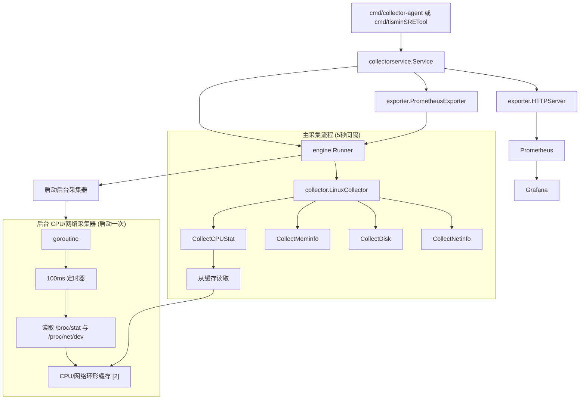

# tisminSRETool

`tisminSRETool` 是一个基于 Go 的 Linux 主机监控服务。它从 `/proc` 和 `statfs` 采集系统指标，在内存中保存最近一次采集快照，并暴露 Prometheus 指标。

## 当前定位

- 仅支持 Linux
- 数据来源：`/proc`、`statfs`
- 生产入口：`cmd/collector-agent/main.go`
- 兼容入口：`cmd/tisminSRETool/main.go`
- 可选调试入口：`cmd/debug_tool/debug.go`
- 历史时序数据不由程序内部保存，依赖 Prometheus 抓取和存储

## 当前已实现功能

- 周期性采集 CPU、内存、磁盘、网络指标
- 通过 `engine.Runner` 维护最近一次快照
- 暴露可配置路径的 Prometheus 指标
- 提供健康检查和最近一次采集状态接口

## 当前采集指标

- CPU：核心数、平均使用率、每核使用率、1/5/15 分钟负载
- 内存：总量、空闲、可用、已用、Swap、使用率
- 磁盘：容量、空闲/已用字节、inode 使用情况、读写字节、await、util
- 网络：收发字节、包数、错误数、丢包数

## 架构概览


```mermaid
flowchart TB
    MAIN["cmd/collector-agent 或 cmd/tisminSRETool"] --> SERVICE["collectorservice.Service"]
    SERVICE --> RUNNER["engine.Runner"]

    subgraph BG["后台 CPU/网络采集器 (启动一次)"]
        BG_GO["goroutine"] --> TICKER["100ms 定时器"]
        TICKER --> READ["读取 /proc/stat 与 /proc/net/dev"]
        READ --> BUFFER["CPU/网络环形缓存 [2]"]
    end

    RUNNER --> START_BG["启动后台采集器"]
    START_BG --> BG

    subgraph MAIN_FLOW["主采集流程 (5秒间隔)"]
        RUNNER --> COLLECTOR["collector.LinuxCollector"]
        COLLECTOR --> CPU["CollectCPUStat"]
        CPU --> READ_BUF["从缓存读取"]
        READ_BUF --> BUFFER
        COLLECTOR --> MEM["CollectMeminfo"]
        COLLECTOR --> DISK["CollectDisk"]
        COLLECTOR --> NET["CollectNetinfo"]
    end

    SERVICE --> EXPORTER["exporter.PrometheusExporter"]
    EXPORTER --> RUNNER
    SERVICE --> HTTP["exporter.HTTPServer"]
    HTTP --> PROM["Prometheus"]
    PROM --> GRAFANA["Grafana"]
```

### 核心架构要点

- **CPU/网络后台采集**: 独立 goroutine 以固定 100ms 间隔采样 `/proc/stat` 与 `/proc/net/dev`
- **环形缓存**: CPU、网络快照分别存入 2 槽位环形缓冲区，带时间戳
- **主流程无阻塞**: 主采集器只读缓存，无 sleep、无阻塞
- **统一生命周期**: 入口处理信号，Service 统一启动和关闭 Runner、Exporter、HTTP Server

### 运行流程

1. `main.go` 使用 Viper 加载配置并创建根上下文。
2. `collectorservice.Service` 创建并统一管理运行组件。
3. `engine.Runner` 启动后台 CPU/网络采集器（启动一次，持续采样）。
4. `engine.Runner` 立即执行一次采集，然后按配置间隔循环采集。
5. `LinuxCollector` 并发执行 CPU、内存、磁盘、网络采集。
   - **CPU/网络**: 优先从环形缓存读取（无阻塞）
   - **内存/磁盘**: 直接采集
6. `Runner` 保存最近一次指标快照和采集错误，并向读取方返回防御性拷贝。
7. `PrometheusExporter` 周期性读取 `Runner.Snapshot()` 并刷新私有 Registry。
8. `HTTPServer` 暴露 `/health`、`/status` 和配置中的 metrics 路径。

## HTTP 接口

| 接口 | 说明 |
|---|---|
| `/health` | 存活检查，返回 `200 OK` |
| `/status` | 返回最近一次采集状态 |
| `/metrics` | 默认 Prometheus 指标端点 |

其中 Prometheus 指标路径可通过 `prometheus.path` 配置修改。

## 配置说明

生产入口默认读取 `configs/collector.yaml`，兼容入口默认读取 `configs/config.yaml`。

关键配置块：

- `app`：服务名、版本、采集间隔、日志
- `http`：监听地址和超时
- `prometheus`：是否启用以及 metrics 路径
- `diagnostic`：为后续诊断能力预留，当前未接入主运行链路

指定配置文件运行：

```bash
go run ./cmd/tisminSRETool -config configs/config.yaml
```

查看版本：

```bash
go run ./cmd/tisminSRETool -version
```

## 本地运行

运行测试：

```bash
go test ./...
```

启动生产服务：

```bash
go run ./cmd/collector-agent
```

检查接口：

```bash
curl http://localhost:8080/health
curl http://localhost:8080/status
curl http://localhost:8080/metrics
```

启动调试模式：

```bash
go run ./cmd/debug_tool
```

## 目录结构

```text
cmd/
  collector-agent/        生产服务入口
  debug_tool/            调试运行入口
  tisminSRETool/         兼容服务入口
configs/                 服务配置
internal/collector/      Linux 指标采集
internal/engine/         调度与快照状态
internal/exporter/       Prometheus exporter 与 HTTP 服务
internal/model/          配置与指标模型
internal/service/        服务生命周期编排
pkg/utils/               带 context 的文件读取工具
```

## 当前限制

- 仅支持 Linux，非 Linux 环境不能得到有效主机指标
- 程序只保存最近一次快照，不负责历史数据存储
- `diagnostic` 代码目前未接入主运行流程
- `ProcStat` 已在模型中定义，但当前主流程并未采集进程级指标

## 相关文档

- English README: `README.md`
- 当前架构与 Context 流程：`docs/CURRENT_ARCHITECTURE_CONTEXT_FLOW_ZH.md`

## License

MIT
