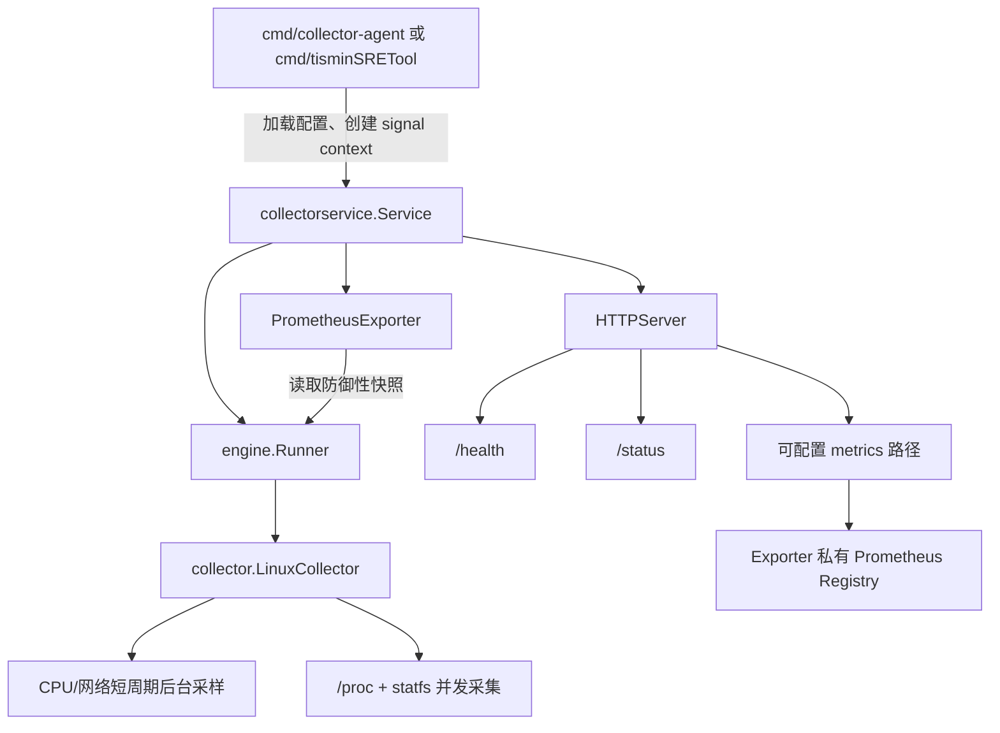

# tisminSRETool 当前架构与 Context 流程

## 1. 架构目标

当前版本定位为 Linux 主机指标采集 Agent：负责采集、保留最新快照并暴露 Prometheus 指标。历史存储、规则计算、告警抑制和通知交给 Prometheus/Alertmanager，Agent 内不再维护 SMTP 告警链路。

核心约束：

- 入口只处理参数、系统信号和进程退出。
- `Service` 统一编排 Runner、Exporter 和 HTTP Server。
- `Runner` 只负责采集调度、后台采样生命周期和最新快照。
- `Collector` 不依赖 HTTP、Prometheus 或进程信号。
- 所有长期运行组件共享同一个可取消的 `context.Context`。

## 2. 组件关系

依赖方向固定为 `cmd -> service -> engine/exporter -> collector/model`，下层包不得反向依赖入口或 Service。

## 3. 启动与关闭流程

1. 入口加载 YAML 和 `TISMIN_*` 环境变量，完成默认值与保留路径校验。
2. 入口使用 `signal.NotifyContext` 将 `SIGINT`/`SIGTERM` 转为根 Context 取消。
3. `Service.Run` 派生运行 Context，并启动 Runner、可选的 Prometheus 刷新器和 HTTP Server。
4. Runner 启动 LinuxCollector 的 CPU/网络短周期采样，然后立即采集一次，再按 `refresh_interval` 周期采集。
5. 根 Context 取消或 HTTP Server 返回错误时，Service 取消所有组件。
6. Runner 等待其后台采样退出后关闭 `Done`；Service 等待全部 goroutine，超过关闭超时才返回错误。

系统信号不能在 `internal` 包中监听，否则 Service 无法被测试、嵌入或由上层统一编排。

## 4. 数据与并发契约

- `LinuxCollector.Collect` 并发采集 CPU、内存、磁盘和网络，各子任务通过带缓冲结果通道回传，不在超时返回后继续修改已返回的 Metrics。
- `Collect` 会等待本轮全部 worker 退出后再返回，Runner 的单一循环不会产生跨轮次重叠。
- CPU、网络 sampler 属于各自的 `LinuxCollector` 实例，不在不同 Runner 之间共享缓存。
- CPU、网络环形缓存始终按“旧快照 -> 新快照”返回。
- `RxBytes`、`TxBytes` 等字段保持内核累计计数；`RxSpeed`、`TxSpeed` 单独保存每秒速率。
- `Runner.Snapshot` 返回深拷贝，调用方不能修改 Runner 内部状态。
- Runner 为一次性生命周期对象；重复调用 `Run` 会立即返回。

## 5. Prometheus 与 HTTP

- 每个 `PrometheusExporter` 使用独立 Registry，避免测试、重复 Service 实例或进程内嵌场景发生重复注册 panic。
- `/health` 是进程存活检查，正常返回 `200`。
- `/status` 在尚未产生快照或最近采集存在错误时返回 `503`，成功时返回最近更新时间。
- `prometheus.enabled=false` 时不注册 metrics 路由。
- metrics 路径不能占用 `/health` 或 `/status`。

## 6. 入口说明

- `cmd/collector-agent`：Makefile 默认构建的生产入口，默认读取 `configs/collector.yaml`。
- `cmd/tisminSRETool`：兼容入口，默认读取 `configs/config.yaml`。

两个入口必须复用同一个 `collectorservice.Service`，禁止再次复制 Runner、HTTP 或配置编排逻辑。

## 7. 扩展规则

- 新采集项实现于 `internal/collector`，并加入 `model.Metrics`。
- 新导出指标实现于 `internal/exporter`，累计值和速率必须使用不同字段及指标名。
- 新的常驻组件由 Service 启停，并纳入统一等待组与关闭超时。
- 告警规则应配置在 Prometheus/Alertmanager；若未来重新引入 Agent 内告警，必须作为独立消费者读取 Snapshot，不能耦合进 Collector。
